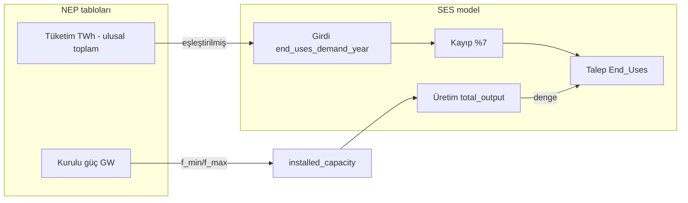

# Türkiye NEP (2030 / 2035) — Kurulu Güç, Tüketim ve Üretim Uyum Kontrolü

**Tarih:** 18 Mayıs 2026  
**Kaynak sonuçlar:** `output_turkey_reference_2030/`, `output_turkey_reference_2035/` (son başarılı AMPL çözümleri)  
**Karşılaştırma hedefi:** Ulusal Enerji Planı (NEP) tabloları — *Elektrik Kurulu Gücü (GW)* ve *Elektrik Tüketiminde Sektörler (TWh)*

---

## 1. Özet yargı

| Boyut | 2030 | 2035 | Genel |
|-------|------|------|--------|
| **Kurulu güç (yakıt bazında)** | Büyük ölçüde uyumlu (±3 % içinde); **Diğer** ve **toplam** hafif sapma | Aynı | Uyumlu sayılır |
| **Tüketim (ulusal toplam)** | **455,2 TWh** girdi = NEP **455,3 TWh** | **510,5 TWh** = NEP **510,5 TWh** | Tam uyum (tasarım gereği) |
| **Tüketim (sektör satırları)** | Mesken, hizmetler, ulaştırma uyumlu; **sanayi satırı** NEP’ten yüksek | Aynı | Bilinçli toplulaştırma |
| **Üretim ↔ tüketim dengesi (model içi)** | Üretim ≈ talep (**~489,5 TWh**) | Üretim ≈ talep (**~548,9 TWh**) | Model dengesi sağlanmış |
| **NEP üretim hedefi** | Paylaşılan tablolarda **yıllık üretim (TWh) hedefi yok** | — | Yalnızca kurulu güç + tüketim karşılaştırılabilir |

**Kısa cevap:** Kurulu güç ve ulusal elektrik tüketimi hedefleri modele doğru yansıtılmış; çözüm sonrası üretim, modele gömülü **%7 iletim kaybı** ile birlikte talebi karşılayacak şekilde dengelenmiş. NEP’teki **sektör satırları** ile model çıktısı bire bir örtüşmez (sanayi + santral içi + diğer + temiz yakıt tek `INDUSTRY` kaleminde toplanır). NEP tablolarında ayrı bir **üretim (TWh)** satırı olmadığı için “üretim hedefi” doğrudan kontrol edilemez; model üretimi, kapasite ve kapasite faktörleriyle tutarlıdır.

---

## 2. Veri kaynakları ve yöntem

### 2.1 NEP referans değerleri (kullanıcı tabloları)

**Kurulu güç (GW)**

| Yakıt | 2030 | 2035 |
|-------|-----:|-----:|
| Kömür | 22,8 | 24,3 |
| Gaz | 30,3 | 35,5 |
| Nükleer | 4,8 | 7,2 |
| Hidrolik | 35,1 | 35,1 |
| Rüzgar | 18,1 | 29,6 |
| Güneş | 32,9 | 52,9 |
| Diğer | 5,1 | 5,1 |
| **Toplam** | **149,1** | **189,7** |

**Elektrik tüketimi (TWh)**

| Kalem | 2030 | 2035 |
|-------|-----:|-----:|
| Sanayi | 156,2 → NEP sektör tablosunda **181,1** (2030) | 208,0 |
| Mesken | 83,1 | 85,6 |
| Hizmetler | 114,5 | 111,5 |
| Ulaştırma | 8,5 | 24,5 |
| Sektörler toplamı | 387,3 | 429,6 |
| Santral iç tüketim | 20,4 | 19,7 |
| Diğer | 40,0 | 40,9 |
| Temiz yakıt üretimi | 7,6 | 20,3 |
| **Ulusal toplam** | **455,3** | **510,5** |

*Not: 2030 sanayi satırı, proje `.dat` yorumlarında NEP **181,1 TWh** olarak geçer; özet tabloda farklı bir satır varsa model girdisi 181,1 TWh sanayi sektör talebine bağlanmıştır.*

### 2.2 Model çıktı dosyaları

| Dosya | Kullanım |
|-------|----------|
| `installed_capacity_by_fuel_gw.txt` | Optimizasyon sonrası kurulu güç (GW) |
| `params.txt` → `end_uses_demand_year` | Senaryo girdisi (GWh/yıl) |
| `End_Uses.txt` | Çözüm sonrası aylık talep gücü (GW); yıllık enerji = Σ \|P_t\| × `period_duration[t]` |
| `losses.txt` | Yıllık iletim kayıpları (GWh) |
| `total_output.txt` | Teknoloji bazında yıllık üretim (GWh) |
| `monthly_electricity_supply_gwh.txt` | Aylık üretim (kontrol) |

Senaryo girdileri: `scenarios/turkey_reference_2030/ses_main_turkey_reference_2030.dat`, `scenarios/turkey_reference_2035/ses_main_turkey_reference_2035.dat`.

---

## 3. Kurulu güç karşılaştırması

Model, NEP yakıt gruplarına şu şekilde eşlenir:

| NEP | Model (`installed_capacity_by_fuel_gw.txt`) |
|-----|---------------------------------------------|
| Kömür | `coal` (COAL_US + COAL_IGCC + CCS kademeleri) |
| Gaz | `natural_gas` (CCGT + CCGT_CCS) |
| Nükleer | `nuclear` |
| Hidrolik | `hydro_dam` + `hydro_river` |
| Rüzgar | `wind` |
| Güneş | `solar_pv` |
| Diğer | `geothermal` + `biomass` + `other_electric` |

### 3.1 Reference 2030

| Yakıt | Model (GW) | NEP (GW) | Fark (GW) | Fark (%) |
|-------|----------:|---------:|----------:|---------:|
| Kömür | 22,50 | 22,8 | −0,30 | −1,3 % |
| Gaz | 30,00 | 30,3 | −0,30 | −1,0 % |
| Nükleer | 5,00 | 4,8 | +0,20 | +4,2 % |
| Hidrolik | 34,26 | 35,1 | −0,84 | −2,4 % |
| Rüzgar | 18,10 | 18,1 | ≈0 | ≈0 % |
| Güneş | 32,90 | 32,9 | ≈0 | ≈0 % |
| Diğer | 8,54 | 5,1 | +3,44 | +67,5 % |
| **Toplam** | **151,31** | **149,1** | **+2,21** | **+1,5 %** |

### 3.2 Reference 2035

| Yakıt | Model (GW) | NEP (GW) | Fark (GW) | Fark (%) |
|-------|----------:|---------:|----------:|---------:|
| Kömür | 24,00 | 24,3 | −0,30 | −1,2 % |
| Gaz | 34,50 | 35,5 | −1,00 | −2,8 % |
| Nükleer | 7,00 | 7,2 | −0,20 | −2,8 % |
| Hidrolik | 34,26 | 35,1 | −0,84 | −2,4 % |
| Rüzgar | 29,60 | 29,6 | ≈0 | ≈0 % |
| Güneş | 52,90 | 52,9 | ≈0 | ≈0 % |
| Diğer | 8,54 | 5,1 | +3,44 | +67,5 % |
| **Toplam** | **190,81** | **189,7** | **+1,11** | **+0,6 %** |

### 3.3 Kurulu güç yorumu

1. **Ana teknolojiler (kömür, gaz, nükleer, hidro, rüzgar, güneş)** NEP ile pratik olarak örtüşüyor; farklar çoğunlukla **0,2–1,0 GW** bandında ve **beş kademeli kömür/gaz dispatch** bölünmesinden kaynaklanıyor.
2. **Nükleer 2030:** Model **5,0 GW** seçmiş (NEP 4,8 GW); `ref_size["NUCLEAR"]=1 GW` nedeniyle tamsayı yuvarlama ve `f_max` bandı.
3. **Hidrolik:** Kapasite **~34,3 GW** (26,26 baraj + 8,0 nehir); NEP **35,1 GW** — **~0,84 GW** eksik; baraj/nehir payı (`75 % / 25 %`) sabit.
4. **Diğer (+3,44 GW):** Model, jeotermal (**~1,7 GW**), biyokütle (**~3,4 GW**) ve `other_electric` (**~3,4 GW**) ayrı raporlar; NEP **“Diğer 5,1 GW”** ile **aynı tanım değil**. Toplamda **+2,2 GW (2030)** / **+1,1 GW (2035)** fazla kapasite, büyük ölçüde bu sınıflandırma farkından gelir.
5. Senaryo girdisi (`f_min`/`f_max`) NEP hedeflerine hizalanmış; `scenarios/turkey_dispatch_capacity_only.dat` ile optimizasyon **kapasiteyi serbest bırakmıyor** — çıktı kapasitesi üst sınırlara yakın.

---

## 4. Tüketim karşılaştırması

### 4.1 Model girdisi (`end_uses_demand_year`) — NEP ulusal toplam

| Yıl | Model girdi (TWh) | NEP ulusal toplam (TWh) | Fark |
|-----|------------------:|------------------------:|-----:|
| 2030 | **455,2** | **455,3** | −0,1 |
| 2035 | **510,5** | **510,5** | 0,0 |

Dört SES sektörü toplamı (`HOUSEHOLDS` + `SERVICES` + `INDUSTRY` + `TRANSPORTATION`) NEP **“Toplam”** satırıyla **bilinçli olarak eşitlenmiş** (`.dat` dosyalarındaki yorumlar).

### 4.2 Sektör satırları — NEP “Sektörler” tablosu vs model

Modelde **sanayi** (`INDUSTRY`), NEP’te ayrı satırlar olan kalemleri de içerir:

| Ek kalem (NEP, TWh) | 2030 | 2035 |
|---------------------|-----:|-----:|
| Santral iç tüketim | 20,4 | 19,7 |
| Diğer | 40,0 | 40,9 |
| Temiz yakıt üretimi | 7,6 | 20,3 |
| **Ek toplam** | **68,0** | **80,9** |

**2030**

| Sektör | Model girdi (TWh) | NEP sektör tablosu (TWh) | Fark |
|--------|------------------:|-------------------------:|-----:|
| Mesken | 83,1 | 83,1 | 0,0 |
| Sanayi | **249,1** | **181,1** | **+68,0** |
| Hizmetler | 114,5 | 114,5 | 0,0 |
| Ulaştırma | 8,5 | 8,5 | 0,0 |
| **Dört sektör toplamı** | **455,2** | — | — |
| NEP sektörler toplamı | — | 387,3 | — |

Doğrulama: **181,1 + 68,0 = 249,1 TWh** → sanayi farkı tamamen **topulaştırma**.

**2035:** **208,0 + 80,9 = 288,9 TWh** (`INDUSTRY` model girdisi) — aynı mantık.

### 4.3 Çözüm sonrası talep ve kayıplar

| Yıl | Model girdi (TWh) | `losses.txt` (TWh) | `End_Uses` ELECTRICITY (TWh) | Girdi × 1,075 |
|-----|------------------:|-------------------:|-----------------------------:|--------------:|
| 2030 | 455,2 | 34,3 | **489,5** | 487,1 |
| 2035 | 510,5 | 38,4 | **548,9** | 546,2 |

- `loss_coeff["ELECTRICITY"] = 0,07` → iletim kaybı **~%7**.
- Çözülmüş yıllık talep (**489,5 / 548,9 TWh**), girdi + kayıplarla uyumlu: **455,2 × 1,075 ≈ 489,3 TWh** (2030).

**Sonuç:** NEP **“tüketim”** tablosundaki **455,3 / 510,5 TWh** “son kullanıcı + santral içi + …” anlamındaki **enerji hizmeti talebidir**; model denge katmanındaki **ELECTRICITY talebi** ise **kayıplar dahil sistem ihtiyacıdır** (~%7,5 daha yüksek).

---

## 5. Üretim karşılaştırması ve denge

### 5.1 Yıllık üretim (model)

| Yıl | Yerli üretim (TWh) | İthalat (TWh) | Çözülmüş talep (TWh) | Üretim − talep |
|-----|-------------------:|--------------:|---------------------:|---------------:|
| 2030 | **489,5** | 0,0 | **489,5** | **≈ 0** |
| 2035 | **548,9** | 0,0 | **548,9** | **≈ 0** |

- Üretim: `total_output.txt` içinde `TECHNOLOGIES_OF_END_USES_TYPE[ELECTRICITY]` toplamı.
- Aylık dosya toplamı üretimle **aynı** (2030: 489 462 GWh; 2035: 548 925 GWh).
- İthalat bu çözümde **kullanılmamış** (`avail["ELECTRICITY"]` tanımlı olsa da optimumda 0).

### 5.2 Üretim vs NEP “tüketim” (farklı tanım)

| Yıl | Model üretim (TWh) | NEP ulusal tüketim (TWh) | Oran |
|-----|-------------------:|-------------------------:|-----:|
| 2030 | 489,5 | 455,3 | **1,075** |
| 2035 | 548,9 | 510,5 | **1,075** |

Fark, modeldeki **iletim kayıpları** ile açıklanır; bu bir **tutarsızlık değil**, enerji dengesi katmanları arasındaki tanım farkıdır.

### 5.3 Yakıt bazında üretim ve kapasite faktörü (2030 / 2035)

| Yakıt | Kurulu (GW) | Üretim 2030 (TWh) | CF 2030 | Üretim 2035 (TWh) | CF 2035 |
|-------|------------:|------------------:|--------:|------------------:|--------:|
| Nükleer | 5,0 / 7,0 | 37,2 | 85 % | 52,1 | 85 % |
| Kömür | 22,5 / 24,0 | 169,6 | 86 % | 142,5 | 68 % |
| Gaz | 30,0 / 34,5 | 94,7 | 36 % | 108,0 | 36 % |
| Hidro | 34,3 | 80,6 | 27 % | 80,6 | 27 % |
| Rüzgar | 18,1 / 29,6 | 53,6 | 34 % | 87,6 | 34 % |
| Güneş | 32,9 / 52,9 | 40,1 | 14 % | 64,5 | 14 % |

- Hidro üretimi **müsaitlik profili** (`c_p_t`) ile sınırlı; kurulu güç NEP’ten düşük olsa da üretim profili tutarlı.
- Güneş/rüzgar CF’leri tipik yenilenebilir aralığında.

**NEP’te yıllık üretim (TWh) hedefi paylaşılmadığı için** “üretim hedefi sapması” hesaplanamaz; mevcut veriyle **kurulu güç → üretim** zinciri iç tutarlıdır.

### 5.4 Kurulu güç, üretim ve tüketim birlikte



- **K → P:** Kapasite yeterli; üretim talebi karşılıyor.
- **T → G:** Ulusal toplam bire bir.
- **G → D → P:** Kayıplar sonrası üretim = talep.

---

## 6. Diğer senaryolar (kısa)

| Senaryo | 2030 / 2035 çözüm | Kurulu güç / talep |
|---------|-------------------|-------------------|
| `turkey_drought_*` | Reference ile **aynı kapasite ve talep girdisi**; hidro `c_p_t` farklı | Kurulu güç tablosu reference’a çok yakın |
| `turkey_drought_emcap_*` | Bazı yıllarda `scenario_run_error.txt` (emisyon tavanı) | Bu rapor **reference** sonuçlarına odaklanır |

---

## 7. Sonuç ve öneriler

### Uyumlu olanlar

1. **NEP ulusal elektrik tüketimi** (455,3 / 510,5 TWh) → model `end_uses_demand_year` toplamı.  
2. **Ana kurulu güç kalemleri** (kömür, gaz, nükleer, hidro, rüzgar, güneş) → **~±3 %** içinde.  
3. **Model enerji dengesi** → üretim = talep (ithalatsız çözüm).  
4. **Üretim / NEP tüketim oranı (~1,075)** → **%7 iletim kaybı** ile tutarlı.

### Dikkat gerektirenler

1. **NEP “Diğer” (5,1 GW) ≠ model “diğer” raporu (8,5 GW)** — jeotermal + biyokütle + diğer elektrik ayrımı.  
2. **NEP sektör tablosu ≠ model sektör çıktısı** — sanayi hattında **+68 / +81 TWh** toplulaştırma; karşılaştırma için NEP’teki *santral içi + diğer + temiz yakıt* kalemlerini sanayi ile toplamak gerekir.  
3. **Hidrolik kapasite ~0,84 GW düşük** (35,1 → 34,26 GW).  
4. Paylaşılan NEP görsellerinde **yıllık üretim (TWh) hedefi yok**; üretim yalnızca model içi denge ve CF mantığıyla değerlendirildi.

### İsteğe bağlı iyileştirmeler

- `installed_capacity_by_fuel_gw` raporunda **NEP ile aynı “Diğer” kökene** indirgeme (jeotermal + biyokütle → 5,1 GW tavanı).  
- Hidro toplamını **35,1 GW**’a çekmek için baraj/nehir `f_max` ayarı.  
- Dashboard’da **iki talep göstergesi**: “NEP ulusal tüketim” ve “Sistem talebi (kayıplı)”.  
- NEP’ten **yıllık brüt üretim / brüt tüketim** tablosu eklenirse üretim hedefi karşılaştırması yapılabilir.

---

## 8. Tekrar üretim komutu

```bash
./run_all_turkey_scenarios.sh   # veya yalnızca reference 2030/2035
python3 build_scenario_dashboard_data.py
```

---

*Bu rapor otomatik hesaplamalar ve `output_turkey_reference_2030|2035` dosyalarının okunmasıyla üretilmiştir.*
